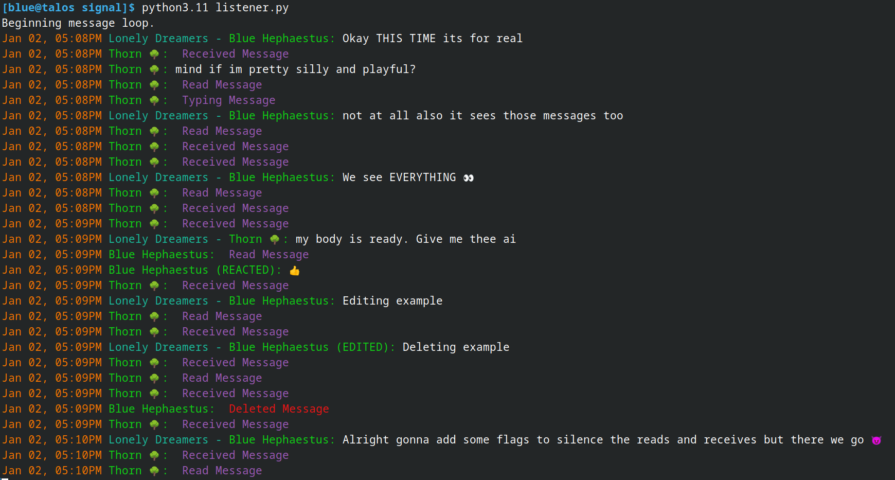

# Description

Hello! These are messenger bots. As I add more platforms with individual (or merged) bots to support each one, I will add them here. These are created with the goal of making one unified AI-empowered system to receive all messages from all sources (email, text, signal, discord, and so on), then process them however I want. 

At the time of writing, I just wanted to put this on github so a lot of the code is not very cleaned up yet. 

The most recent one is the signal bot, which is empowered with GPT4 and can respond with a rather humorous personality to any messages sent to my account on signal.

More details can be found in each subdirectory!

Example of Signal bot: 

### Planned Next Steps
So we need a unified system of message data that works across EVERYTHING.
Platforms:
* Email
* Text
* Signal
* Discord
* Telegram
* Instagram

Pending any more.

What is unified for any given message?
1. Id - Identifier of this message. 
2. Timestamp - unix, and human readable.
3. Platform - one of the above
4. Group(or channel) - Possible group or channel the message belongs to.
5. Source - Person who sent the data, either in a DM or a group.
6. Referred - Message being referred to in this message, like responding to a thread or reacting to a message
7. Attachment(s) - Possible attachment or attachments for a message.
8. Content - Actual text content of the message.
9. Type - Type of the message. May be a TON of different things, including:
   1. Message (normal)
   2. Group Message
   3. Edit
   4. Delete
   5. React
   6. Read Receipt
   7. Delivery Receipt
   8. Typing Notification
    
These are attributes for ONE message. Using a Message class we can parse any message from any platform into this.
In doing so, we have one consistent message type for all platforms. 

Problem - messages referring to other messages do not make it easy to determine which message they referred to.
How do we parse that? 
    how do we take a message with various identifier reference attributes to other messages and maintain that reference
    when the other messages have already been parsed. How do we take any of those attributes and use them to lookup
    the other object? Well, we'd need a way to search. Which means we'd need a way to test equality. So how do we
    check if an id matches that of a message. We'd need a mapping of weird ID -> message. Messages may have multiple
    different types of identifiers imo. And this will vary across platforms, definitely. 

I think the best way is to just have one attribute that will be a wild card for each message called "Id", which 
    might be a list might be a string might be anything, and for now we just naively search through all messages
    to see which one matches the Id we're looking for. 

If this doesn't work, we can have the equality checker check depending on which platform is being used.

### Origin of "Cabeiri"
My name is Blue Hephaestus. These bots are called "Cabeiri" and are inspired by the messengers and assistant automatons that the god Hephaestus would create in Greek Mythology. Specifically, he once made automaton horses (of varying number) for his sons, the two gods Cabeiri, to assist them. 

Seeking a good name for these automatons, which function as messengers and assistants, I decided on Cabeiri. 